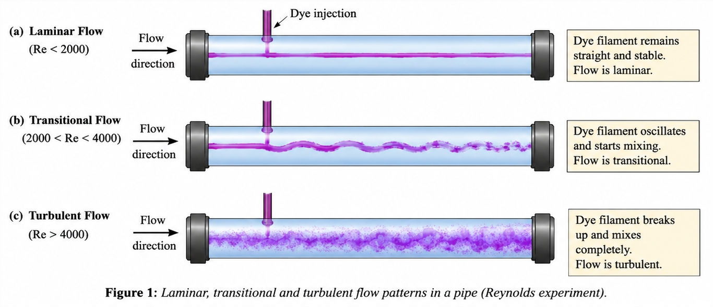
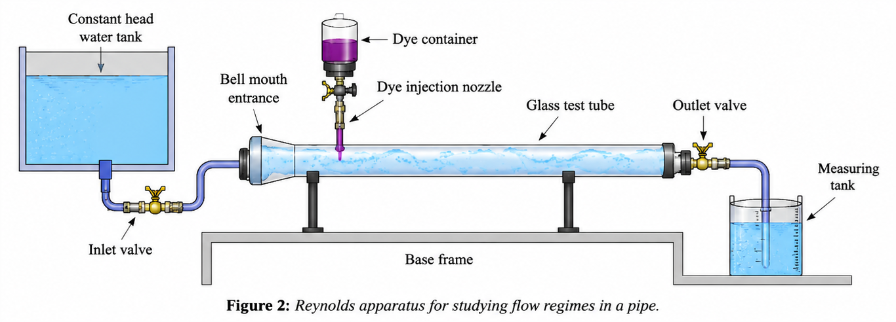

The Reynolds experiment is one of the fundamental experiments in fluid mechanics used to study the nature of fluid flow through a circular pipe. The experiment demonstrates the transition of flow from laminar to turbulent conditions and establishes the significance of the Reynolds number as a criterion for classifying different flow regimes.

The experiment was first performed by Osborne Reynolds in 1883. He observed that the behaviour of a dye filament injected into a flowing stream of water depended upon the flow velocity and the physical properties of the fluid. At low velocities, the dye filament remained straight and undisturbed, indicating laminar flow. As the velocity increased, the dye filament became unstable and eventually mixed completely with the surrounding water, indicating turbulent flow.

Fluid flow through a pipe may be classified into three categories:

### Laminar Flow

Laminar flow occurs when the fluid particles move in smooth, parallel layers without mixing. The motion of the fluid is orderly, and the dye filament remains as a distinct straight line throughout the length of the pipe.

Generally,

$$
Re < 2000
$$

indicates laminar flow.

### Transitional Flow

As the flow velocity increases, disturbances begin to develop in the fluid motion. The dye filament starts to oscillate and partially diffuse into the surrounding fluid.

The transitional region generally occurs for

$$
2000 < Re < 4000.
$$

The flow in this region is unstable and may alternate between laminar and turbulent behaviour.

### Turbulent Flow

At high flow velocities, the fluid particles move randomly and continuously mix with one another. The dye filament rapidly breaks up and spreads throughout the flow.

Generally,

$$
Re > 4000
$$

indicates turbulent flow.

The nature of flow is determined by a dimensionless parameter known as the Reynolds number, which is defined as

$$
Re=\frac{VD}{\nu},
$$

where

- $Re$ = Reynolds number,
- $V$ = Mean velocity of flow, $\mathrm{m/s}$,
- $D$ = Internal diameter of the pipe, $\mathrm{m}$,
- $\nu$ = Kinematic viscosity of the fluid, $\mathrm{m^2/s}$.

The Reynolds number represents the ratio of inertial forces to viscous forces acting within the fluid. Low Reynolds numbers indicate that viscous forces dominate, resulting in laminar flow, whereas high Reynolds numbers indicate that inertial forces dominate, producing turbulent flow.

The average velocity of flow through the pipe is given by

$$
V=\frac{Q}{A},
$$

where

- $Q$ = Discharge through the pipe,
- $A$ = Cross-sectional area of the pipe.

The kinematic viscosity of water depends upon its temperature. Therefore, the temperature of the fluid influences the Reynolds number and the corresponding flow regime.

<em>Figure 1: Laminar, transitional, and turbulent flow patterns observed using dye injection.</em>

The Reynolds apparatus consists of a transparent glass tube connected to a constant head water supply. A dye injection system introduces a coloured fluid into the flowing water, allowing the flow pattern to be observed. The flow rate is controlled by a regulating valve, while the discharge is measured using a collecting tank.

<em>Figure 2: Reynolds apparatus used for determining different regimes of flow.</em>

Initially, water is allowed to flow at a very low velocity and the dye filament remains straight, indicating laminar flow. As the flow rate increases, the dye filament begins to fluctuate, representing transitional flow. Further increase in velocity causes the dye to disperse completely throughout the pipe, indicating turbulent flow.

The Reynolds experiment provides a practical demonstration of the relationship between flow velocity, pipe diameter, fluid viscosity, and flow characteristics. The concept of Reynolds number is extensively used in the design and analysis of pipelines, hydraulic structures, water supply systems, irrigation networks, and various engineering applications involving fluid flow.
